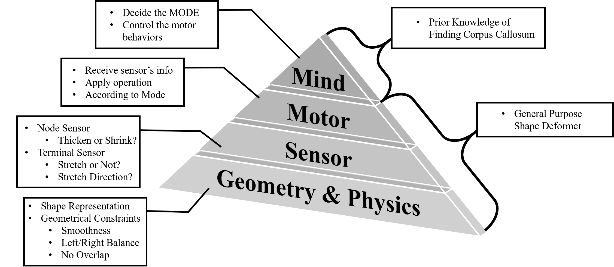

# Deformable Organism Model for Image Analysis

## CS275 Team Project

### Authors

| Danfeng Guo | Wuyue Lu | Ying Sun | Benlin Liu |
| :------: | :--: | :--: | :--: |
| 304588721 | 605257662 | 705256935 | 005352110 |

## Abstract

This project is a teamwork of four members. We will focus on the deformable organism model and its application.  This model is originally designed for medical image analysis, and the authors provide an example of the model dividing a physiological structure  of  a  2D  sagittal  MRI  brain  image  The  whole pipeline  of  the  organism  model  to  find  the  fornix dip contains a series of sub-routines.  Consider the time limit for this project, we may focus on the final deforming  routine  and  provide  the  initial  position manually. We  plan  to  implement  the  deformable organism model and try its deforming behavior on several types of image segmentation problems.

## Resources

* [PDF Report](./pdf/269report.pdf)

  (Also find it at folder `./pdf`)

* [Code ZIP](./code/src.zip)

  (Also find it at folder `./code`)

## Demo

